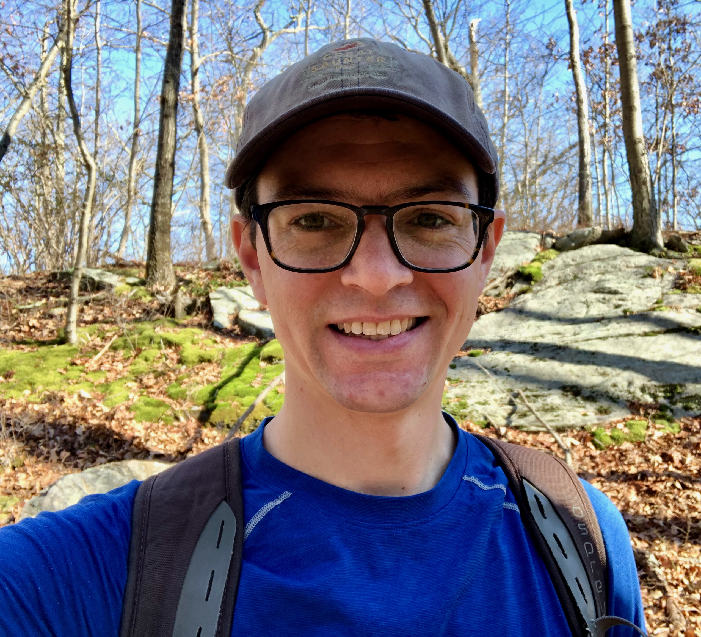

# Timothy D. Sweetser

#### Machine Learning Engineer in New York City

* [LinkedIn](https://www.linkedin.com/in/timothysweetser/)
* [Github](https://github.com/hacktuarial)
* tsweetser@gmail.com
* (508) 450-1915

## Experience

#### HBO Max, New York, NY
Senior Machine Learning Engineer. November 2020 - Present

* Recommender systems and personalization for HBO Max

#### FindMine, New York, NY
Machine Learning Engineer. May 2019 - November 2020

* Increase click through rate by 3% using $\epsilon$-greedy bandit
* Use deep learning to identify similar styles based on images
* Reduce costs by $50K/year by automatically replacing out of stock items in expert-curated fashion outfits
* Save $60K/year in cloud computing costs by shifting computation from database to Python layer
* Write a Flask app to collect quantitative fashion ratings from subject matter experts

#### Rent the Runway, New York, NY

Data Scientist, August 2018 - April 2019

* Develop fit algorithm to boost rental wear rate by +0.01
* Increase user engagement by improving personalized recommendations
* Rewrite production recommendation service using `asyncio`, an asynchronous Python web framework
* Migrate batch model training from laptops to Jenkins

#### Stitch Fix, San Francisco, CA
Data Scientist. July 2015 - June 2018

* Develop personalized recommender systems for women’s clothing and implement them in production
* Increased revenue by $8+ million per year by quantifying style
* Use contextual bandits to optimize where and when to show different recommendations
* Develop end-to-end data science pipelines in Spark, Python and R using AWS, Docker, and Jenkins

#### Coffee Meets Bagel, San Francisco, CA
Intern, January 2015 - June 2015

* Create new matching algorithm using Python and `scikit-learn`
* Result in 10% higher LIKE rates for men and women
* Come up with new and interesting ideas about dating, test them using data, and write engaging blog posts about them. Examples:
	* [It's raining men](https://coffeemeetsbagel.com/blog/index.php/dating-statistics/raining-men/)
	* [How tall are you _really_?](https://coffeemeetsbagel.com/blog/index.php/dating-statistics/how-tall-are-you-really/)

## Education
* M.S. Statistics, **Stanford University**, 2015
* B.A. Mathematics, Clark University, Worcester, MA

## Programming Skills
* Advanced Python (numpy, scipy, pandas, scikit-learn, pytest, asyncio, celery, tensorflow, keras)
* Intermediate R (tidyverse, data.table, ggplot2)
* Intermediate SQL
* Basic [scala](http://github.com/hacktuarial/sudoku) and Java
* Proficient with git, docker, AWS, GCP, and bash
* Basic PySpark, Hive, BigQuery, and Snowflake

## Projects and open-source contributions
* [Diamond](https://github.com/stitchfix/diamond), a very fast iterative solver for mixed-effects models in Python.
* Contributor to [sklearn-pandas](https://github.com/scikit-learn-contrib/sklearn-pandas), a Python package for using sckit-learn with pandas DataFrames
* Fix reproducibility bug for [scikit-image](https://github.com/scikit-image/scikit-image/pull/4251)

## Talks
* "Diamond: Mixed Effects Models in Python", PyData NYC, November 2017
	* [video](https://www.youtube.com/watch?v=jrprjZEX9gU)
	* [slides](https://www.slideshare.net/PyData/diamond-mixed-effects-models-in-python)
